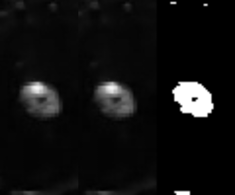
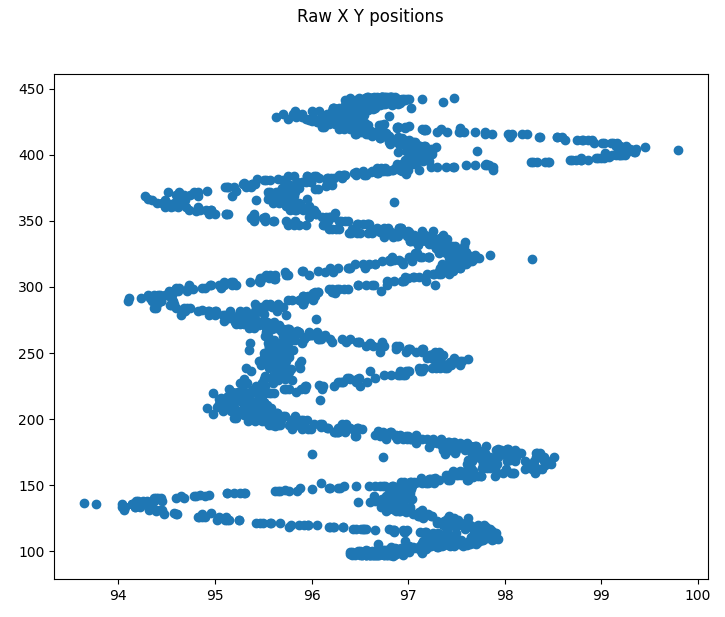
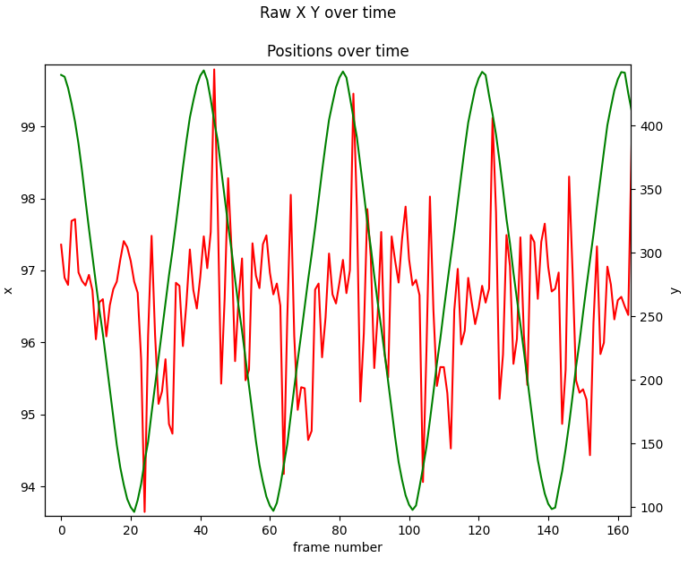
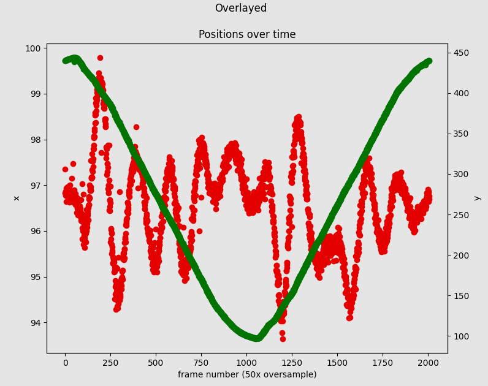

# FDM 3D Printer nozzle oscillation tracking
FDM prints can take hours. Moving faster stresses the hardware, resulting in ugly prints due to oscillations. Modern prosumer printers use accelerometers to measure oscillation frequencies. This repo shows, that commodity smartphone cameras can do the job just as well.

# Hardware Setup
We used a DIY 3D printer with CoreXY kinematics. A 240Hz video capable smartphone is placed below the nozzle, as close as the focus allows. The smartphone flash LED is turned on. Running raw G code to move the print head back and forth quickly gives us full control. Here we used a recording of ~2k frames, which is ~50 back and forth moves.

# Video analysis
Tracking the nozzle should be robust and have sub pixel resolution. Given an initial nozzle position, we track the center of the nozzle. The appearance of the nozzle slightly changes due to motion blur. However, the nozzle geometry in combination with head on illumination by the smartphone flash LED gives us a nicely trackable blob. This way, we extract raw X Y positions from the video.

Purple is the original nozzle position, yellow the newly found one:

ROI of the tracking region and internal state: Stabilized nozzle on the left, next pixture nozzle ROI in the middle, binarized view of ROI to visualize the tracked blob:

# Data analysis
Observing the raw X Y positions yields several key insights:

1. The travel moves show repeatable oscillation patterns, distinct for upward and downward moves:

2. There is a slight misalignment of the video pixel coordinates and the print head move directions. This can be corrected with a heuristically determined rotation.
3. The oscillation of a single move is hard to see, since there are few frames per move and noisy positions:
   
4. Since the frame acquisition frequency and the print head move frequency alias, we can overlay all 50 moves to get a much more detailed position history:

# Summary
This repo shows a POC for tracking printer moves with a generic smartphone camera. It is possible to extract subpixel information of the nozzle position and to overcome the sample rate of the camera sensor by repetitive moves.

In comparison to accelerometers, this allows a more detailed investigation of mechanical tolerances, as it captures the detailed shape of the oscillations. This method can serve as a basis for further printer calibration as well: From squaring the gantry, to finetuning of the kinematics (velocity, accel limits, jerk).

The algorithm is quite simple and could run on a smartphone, allowing closed loop printer calibration.